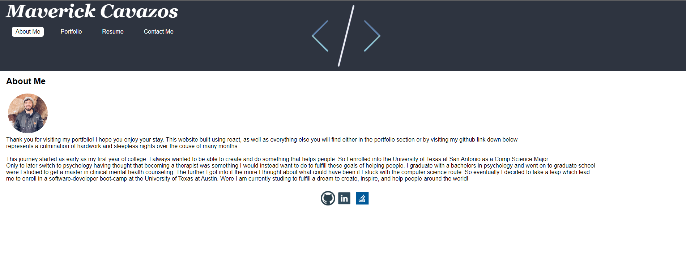

## Coding-Buddy

## description
This is a updated and upgraded portfolio from the previous one which only uses html and css. This was create using largely React, JSX, and some CSS sprinkled in. My portfolio contains a About Me, Portfolio (which includes some of my projects), Resume, and Contact Me section. Each section will have the Navbar visibleat the top and my social media links visible at the booter via the footer.

## Table of Contents

* [Installation](#installation)
* [Usage](#usage)

## Installation
Nothing is required to view or run this application if you are going to view it via the deployed github pages link. If you are trying to view it via the repo, you will have to have all the dependacies install via the package.json and run npm start in your terminal.

## Usage
This application is used to display all of my work throughout the University of Texas at Austin web-developer boot-camp. You can view it either the deployed github pages link or by following the installation instructions above.

Image of the deployed app 

link to deployed app via github pages https://maverickcavazos.github.io/react-portfolio/